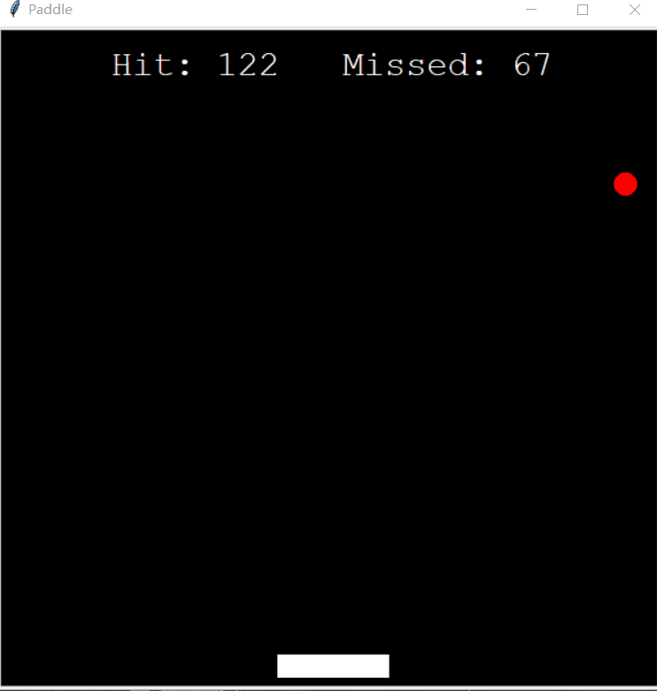
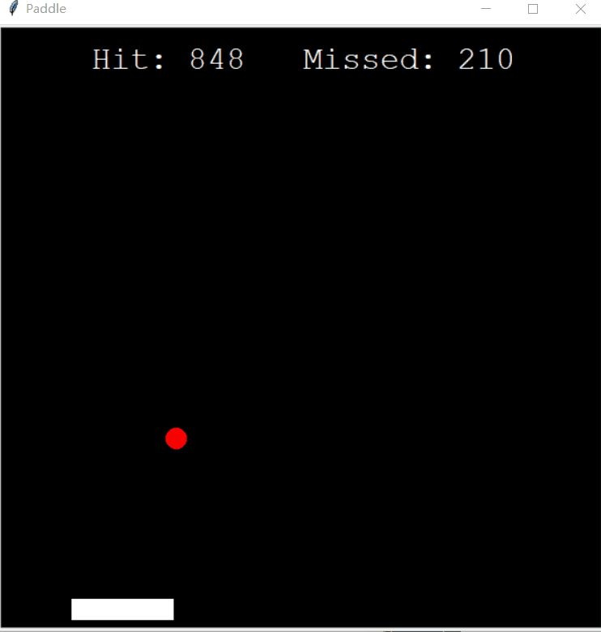
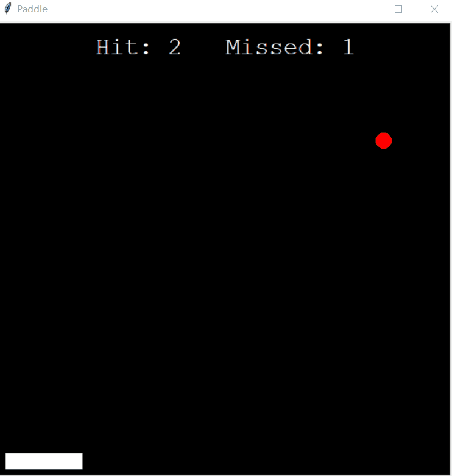
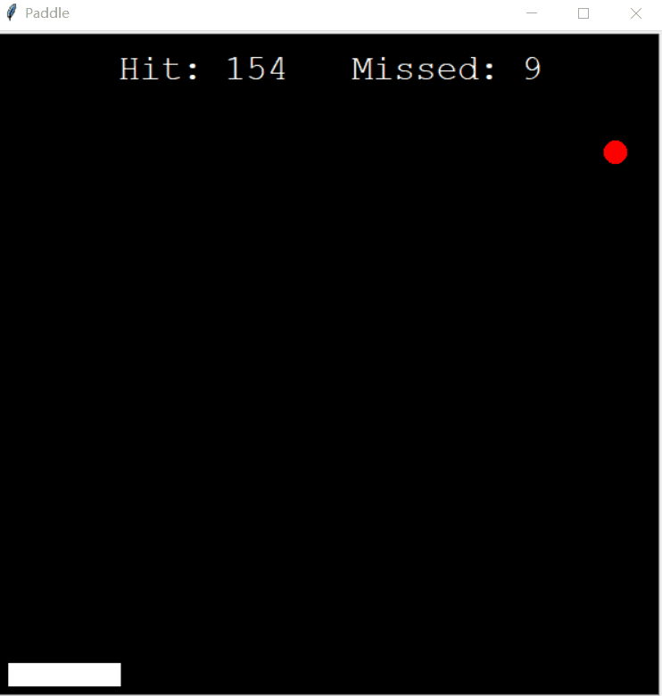

# 基于DQN的平板小球

> 强化学习打卡营 终级项目复现
环境地址为：https://github.com/shivaverma/Orbit

课程地址：https://aistudio.baidu.com/aistudio/education/group/info/1335

## 简介
基于PARL 与百度Paddle框架的强化学习项目, 目标是训练拍子去接红色的小球。本项目使用DQN训练模型去训练。代码框架主要基于上述课程地址的第4节课程的例程并进行调整。

## 环境
基于paddle与PARL 框架
```
!python -m pip install paddlepaddle -i https://mirror.baidu.com/pypi/simple
!pip install parl
```

## 文件目录
文件名称|介绍
---|---
[train.py](./train.py)| 用于训练的文件
[test.py](./test.py) |效果展示文件
[Model.py](./Model.py)| DQN内全连接网络的定义
[Agent.py](./Agent.py) | 训练机的定义
[ReplayMemory.py](./RelpayMemory.py)| 经验池的定义
[Modle](./Model)|用于储存模型
[gif](./gif)|展示用图片

## 效果展示
训练图




测试图




## Tips
* 如果直接从源环境中使用的话他step 函数的state与reward是位置需要调换一下

```Python
Line 102 :return state,self.reward, self.done
```
* 初始的e_greed  最好选取的大一点 否则 可能会导致过了几十个个episode都碰不到球【脸黑】 随着尝试几率越来越低 逐步走向自闭
* 当前MODEL 选择的是训练第1000ep的MODEL 往后训练会越练越差？